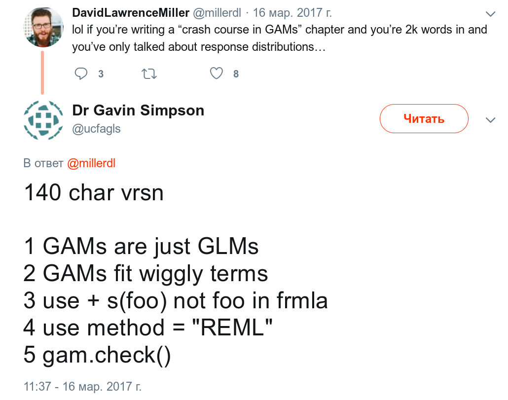

* [Последняя версия](https://agricolamz.github.io/2019.07.31_ANDAN_GAM/index.html)
* [Исходный код](https://github.com/agricolamz/2019.07.31_ANDAN_GAM)

```{r setup, include=FALSE, hide = FALSE}
knitr::opts_chunk$set(echo = TRUE, message = FALSE, fig.width = 9, fig.height = 5)
```

```{r}
library(tidyverse)
library(splines)
library(mgcv)

theme_set(theme_minimal()+theme(legend.position = "bottom"))
```

```{r, include=FALSE, eval=FALSE}
# logo
set.seed(42)
tibble(x = seq(0, 0.5, length.out = 500),
       y = 0.2*x^9*(10*(1-x))^6+10*(10*x)^2*(1-x)^10+rnorm(500, sd = 1.5)) %>% 
  ggplot(aes(x, y))+
  geom_point()+
  geom_smooth(method = "lm", se = FALSE, size = 2)+
  geom_smooth(se = FALSE, color = "red", size = 2)+
  theme_minimal()+
  theme(axis.title = element_blank(),
        axis.text = element_blank())
```

# Полиномы, сплайны, GAM

[](https://twitter.com/ucfagls/status/842444686513991680)

## Введение

Давайте на этой паре будем работать с двумя абстрактными полиномами:
```{r}
set.seed(42)
poly_1 <- tibble(x = 1:100,
                 y = 4*x + 8*x^2+rnorm(100, sd = 5000))

poly_1 %>% 
  ggplot(aes(x, y))+
  geom_point()

set.seed(42)
poly_2 <- tibble(x = seq(0, 0.5, length.out = 500),
                 y = 0.2*x^9*(10*(1-x))^6+10*(10*x)^2*(1-x)^10+rnorm(500, sd = 1.5))
poly_2 %>% 
  ggplot(aes(x, y))+
  geom_point()
```


## Полиномы

$y_i = \sum_{j=0}^k \beta_j \times x^j_i + \epsilon_i = \beta_0 \times x^0_0 + \beta_1 \times x^1_i + ... \beta_k \times x^k_i + \epsilon_i$

```{r}
poly_1 %>% 
  ggplot(aes(x, y))+
  geom_point()

poly_1_fit1 <- lm(y ~ poly(x, 2, raw = TRUE), data = poly_1)
poly_1_fit2 <- lm(y ~ x+I(x^2), data = poly_1)

summary(poly_1_fit1)
summary(poly_1_fit2)

poly_1_fit2_values <- tibble(x = poly_1$x,
                             fit = poly_1_fit2$fitted.values)

poly_1 %>% 
  ggplot(aes(x, y))+
  geom_point()+
  geom_line(data = poly_1_fit2_values, aes(x = x, y = fit), color = "blue")+
  labs(caption = poly_1_fit2$call)
```

## Сплайны


```{r}
library(splines)
poly_1_fit3 <- lm(y ~ bs(x), data = poly_1)
summary(poly_1_fit3)

poly_1_fit3_values <- tibble(x = poly_1$x,
                           fit = poly_1_fit3$fitted.values)
poly_1 %>% 
  ggplot(aes(x, y))+
  geom_point()+
  geom_line(data = poly_1_fit3_values, aes(x = x, y = fit), color = "blue")+
  labs(caption = poly_1_fit3$call) ->
  p1

as_tibble(cbind(bs(poly_1$x), x =poly_1$x)) %>% 
  gather(spline, value, -x) %>% 
  ggplot(aes(x, value, color = spline))+
  geom_line() ->
  s1

gridExtra::grid.arrange(p1, s1)

```


## GAM

### Что такое GAM

Согласно теореме Колмогорова -- Арнольда, каждая непрерывная функция может быть представлена в виде композиции непрерывных функций одной переменной. Композиция --- применение одной функции к результатам другой: $(G\circ F)(x) = G(F(x))$. Подробнее см. [лекции Виктора Клепцына](https://forany.xyz/a-453).


### Ваш первый GAM

```{r}
poly_1_fit4 <- mgcv::gam(y ~ s(x), data = poly_1)
summary(poly_1_fit4)

fitted <- tibble(x = poly_1$x,
                 fit = poly_1_fit4$fitted.values)

poly_1 %>% 
  ggplot(aes(x, y))+
  geom_point()+
  geom_line(data = fitted, aes(x = x, y = fit), color = "blue")+
  labs(caption = poly_1_fit4$call)
```

### Формулы в GAM

### Параметры сглаживания

### Количество базовых функций

### `gam.check()`

### Проверка на concurvity

